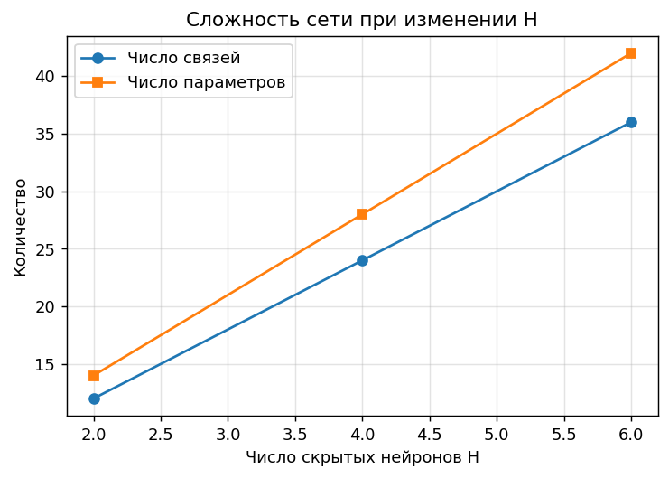
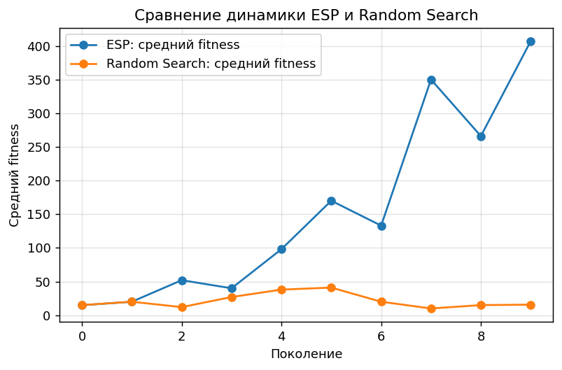
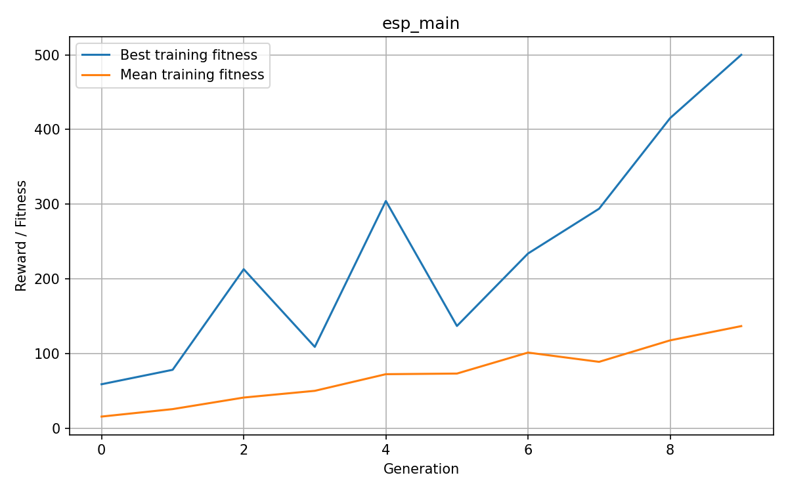
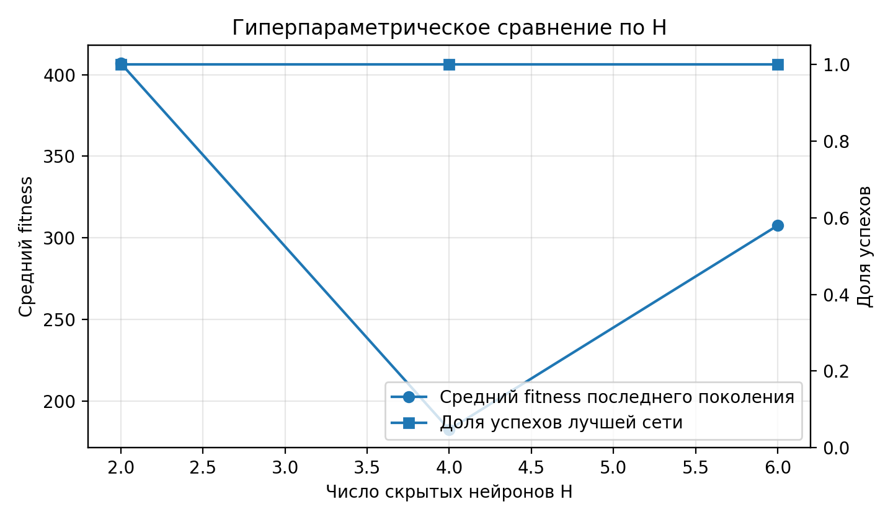
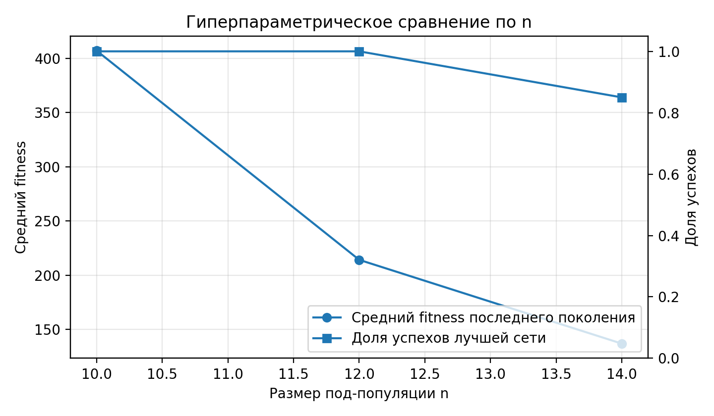
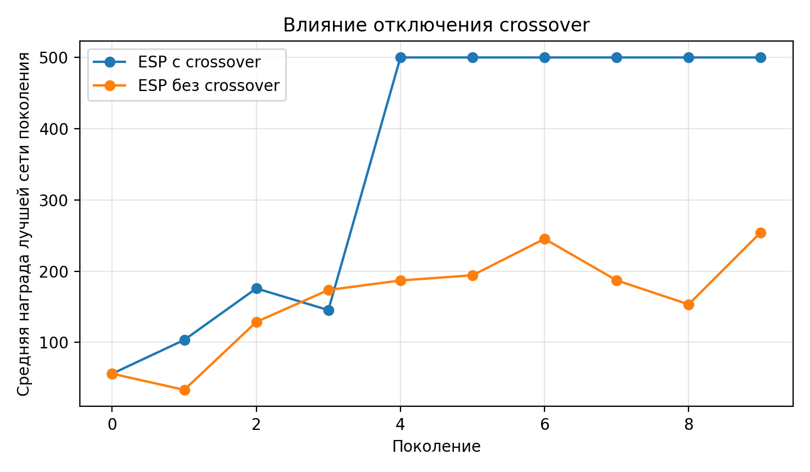
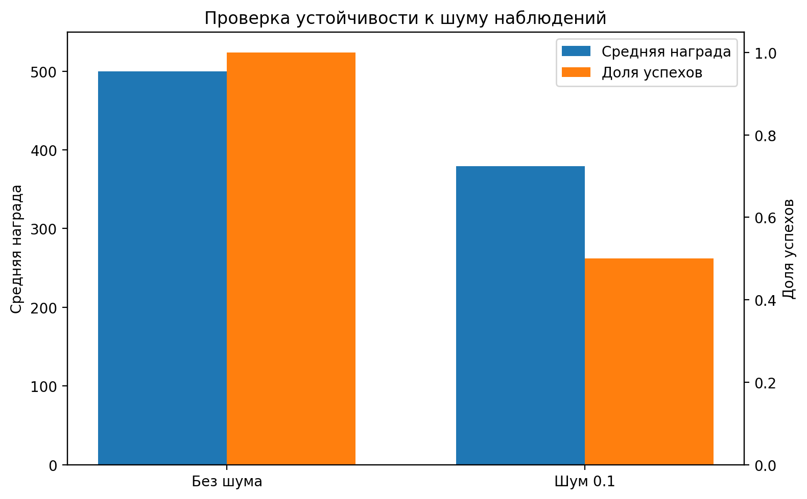

# ESP CartPole Control

Исследовательский проект по обучению нейроэволюционного агента для задачи управления `CartPole-v1`. Агент управляет системой «тележка — перевернутый маятник»: по текущему состоянию среды он выбирает одно из двух действий и должен удерживать маятник в допустимом положении как можно дольше.

Основной метод проекта — **ESP (Enforced Sub-Populations)** для нейронной сети прямого распространения с одним скрытым слоем. В отличие от случайного поиска целых сетей, ESP эволюционирует скрытые нейроны в отдельных под-популяциях, а полная сеть собирается выбором по одной особи из каждой под-популяции.

## Дополнительные материалы

[Эссе об актуальности агентного и нейроэволюционного подхода](AGENTS_ESSAY.md) — пояснение, почему задача CartPole естественно формулируется как агентная система, какие действия выполняет агент и какие компоненты использовались в реализации.

## Постановка задачи

Среда `CartPole-v1` моделирует тележку с закрепленным на ней перевернутым маятником. На каждом шаге агент получает наблюдение:

```text
s(t) = (x(t), x_dot(t), theta(t), theta_dot(t))
```

где `x` — положение тележки, `x_dot` — скорость тележки, `theta` — угол отклонения маятника, `theta_dot` — угловая скорость маятника.

Агент выбирает одно из двух дискретных действий:

| Действие | Смысл |
|---:|---|
| `0` | приложить силу к тележке влево |
| `1` | приложить силу к тележке вправо |

Целевая метрика — суммарная награда за эпизод. В `CartPole-v1` она соответствует числу шагов, в течение которых агент удерживает маятник. Решение считается успешным, если средняя тестовая награда не ниже `475`.

## Архитектура агента

Используется полносвязная нейронная сеть прямого распространения:

```text
4 -> H -> 2
```

| Компонент | Значение |
|---|---:|
| Входов | `4` |
| Выходов | `2` |
| Основное число скрытых нейронов `H` | `2` |
| Активация скрытого слоя | `tanh` |
| Выбор действия | `argmax` по двум выходам сети |

Для одного скрытого нейрона кодируются `4` входных веса, `1` смещение и `2` выходных веса. Поэтому один скрытый нейрон содержит `7` параметров, а сеть с `H` скрытыми нейронами — `7H` параметров.



## Алгоритм ESP

В ESP особью является не вся нейронная сеть, а отдельный скрытый нейрон. Для сети с `H` скрытыми нейронами создается `H` под-популяций. Каждая под-популяция отвечает за одну позицию скрытого нейрона в итоговой сети.

Общая схема обучения:

1. из каждой под-популяции выбирается по одной особи;
2. из выбранных особей собирается полная сеть;
3. сеть запускается в среде `CartPole-v1`;
4. полученный fitness начисляется всем участвовавшим особям;
5. внутри каждой под-популяции выполняются селекция, crossover и мутация;
6. при отсутствии улучшений может применяться burst mutation;
7. лучшая сеть сохраняется по отдельной проверочной серии.

## Что реализовано

- среда управления `CartPole-v1` через `Gymnasium`;
- ESP для сети прямого распространения с одним скрытым слоем;
- вещественное кодирование весов и смещений;
- мутация с распределением Коши;
- одноточечный crossover внутри под-популяций;
- burst mutation при стагнации;
- baseline `Random Search` целых нейронных сетей;
- гиперпараметрические эксперименты по `H` и `n`;
- механистическая абляция без crossover;
- проверка устойчивости к шуму наблюдений;
- сохранение и загрузка лучшей найденной сети.

## Экспериментальный протокол

| Параметр | Значение |
|---|---:|
| Среда | `CartPole-v1` |
| Seed | `1` |
| Поколений | `10` |
| Скрытых нейронов `H` | `2` |
| Размер под-популяции `n` | `10` |
| `episodes_per_fitness` | `3` |
| `mutation_scale` | `0.15` |
| `crossover_rate` | `0.8` |
| `test_episodes` | `20` |
| Порог успеха | `475` |

## Результаты

### ESP против Random Search

В основном сравнении ESP и Random Search использовали согласованный вычислительный бюджет: `20` сетей и `60` эпизодов среды на поколение.

| Метод | `H / n` | Бюджет на поколение | Проверка | Средняя награда | Средний fitness |
|---|---:|---:|---:|---:|---:|
| ESP | `2 / 10` | `20 сетей / 60 эпизодов` | `20/20` | `500.00` | `406.97` |
| Random Search | `2 / 10` | `20 сетей / 60 эпизодов` | `20/20` | `500.00` | `15.67` |

Оба метода смогли найти сеть, проходящую проверку, однако ESP сформировал существенно более качественную популяцию решений. У Random Search успешная сеть была найдена случайно, но средний fitness поколения остался низким.



### Динамика основного ESP

В основном эксперименте лучший fitness достиг максимального значения `500`, а средний fitness поколения вырос до `406.97`. Это показывает, что в ходе эволюции улучшается не только отдельная найденная сеть, но и популяция в целом.



### Гиперпараметрические эксперименты

Сравнение по числу скрытых нейронов `H`:

| `H` | `n` | Бюджет | Проверка | Средняя награда | Средний fitness |
|---:|---:|---:|---:|---:|---:|
| `2` | `10` | `20 сетей` | `20/20` | `500.00` | `406.97` |
| `4` | `10` | `40 сетей` | `20/20` | `500.00` | `182.51` |
| `6` | `10` | `60 сетей` | `20/20` | `500.00` | `307.58` |



Сравнение по размеру под-популяции `n`:

| `n` | `H` | Бюджет | Проверка | Средняя награда | Средний fitness |
|---:|---:|---:|---:|---:|---:|
| `10` | `2` | `20 сетей` | `20/20` | `500.00` | `406.97` |
| `12` | `2` | `24 сети` | `20/20` | `500.00` | `214.08` |
| `14` | `2` | `28 сетей` | `17/20` | `486.90` | `136.82` |



Вывод по гиперпараметрам: увеличение числа скрытых нейронов или размера под-популяции не гарантировало улучшение при фиксированном числе поколений. Базовая конфигурация `H = 2`, `n = 10` оказалась наиболее устойчивой по среднему fitness.

### Абляция crossover

| Вариант | Crossover | Проверка | Средняя награда лучшей сети | Средний fitness |
|---|---|---:|---:|---:|
| Основной ESP | включен | `20/20` | `500.00` | `406.97` |
| ESP без crossover | отключен | `0/20` | `254.40` | `127.42` |

Отключение crossover резко ухудшило результат. Это показывает, что рекомбинация удачных частей геномов является важным механизмом в данной постановке ESP.



### Проверка устойчивости к шуму

| Режим | `noise_std` | Эпизодов | Успехов | Средняя награда |
|---|---:|---:|---:|---:|
| Без шума | `0.00` | `10` | `10/10` | `500.00` |
| С шумом наблюдений | `0.10` | `10` | `5/10` | `379.10` |

Обученная политика полностью успешна в базовой среде, но заметно деградирует при добавлении шума во входные наблюдения. Это указывает на чувствительность найденной сети к искажению состояния.



## Полученный опыт

В ходе выполнения проекта был получен практический опыт в следующих аспектах:

1. **Формализация управления как агентной задачи.** Среда `CartPole-v1` была рассмотрена как последовательное взаимодействие агента со средой через наблюдения, действия и награды.
2. **Реализация нейроэволюционного алгоритма ESP.** Был разобран подход, в котором эволюционируют не целые сети, а отдельные скрытые нейроны в специализированных под-популяциях.
3. **Работа с вещественным кодированием нейросети.** Параметры скрытых нейронов представлялись как хромосомы из весов и смещений.
4. **Сравнение направленного эволюционного поиска с Random Search.** Проект показал, что случайный поиск может найти удачную сеть, но ESP лучше улучшает качество популяции в целом.
5. **Проведение абляционного анализа.** Отключение crossover позволило оценить вклад рекомбинации в качество найденного решения.
6. **Анализ устойчивости агента.** Проверка с шумом наблюдений показала, насколько обученная политика чувствительна к неточным входным данным.
7. **Организация воспроизводимого ML/RL-проекта.** Были использованы конфигурационные файлы, фиксированные seed, сохранение метрик, графиков и лучшей модели.

## Как запустить

Создать и активировать виртуальное окружение:

```bash
python -m venv .venv
```

Windows PowerShell:

```bash
.venv\Scripts\Activate.ps1
```

Linux/macOS:

```bash
source .venv/bin/activate
```

Установить зависимости:

```bash
pip install -r requirements.txt
pip install -e .
```

Запустить основной ESP:

```bash
python -m esp_cartpole.experiments.train_esp --config configs/cartpole_esp.yaml
```

Запустить сохраненного агента:

```bash
python -m esp_cartpole.experiments.play_saved --config configs/cartpole_esp.yaml
```

Запустить baseline Random Search:

```bash
python -m esp_cartpole.experiments.train_random_search --config configs/cartpole_esp.yaml
```

После запуска результаты сохраняются в `results/`, а лучшие сети — в `saved_models/`.

## Выводы

ESP успешно решил базовую задачу `CartPole-v1`: сохраненная сеть получила `20/20` успешных эпизодов и среднюю проверочную награду `500`. При этом средний fitness поколения вырос до `406.97`, что говорит об улучшении качества популяции, а не только о случайном появлении одной удачной сети.

Сравнение с Random Search показало преимущество направленной эволюции скрытых нейронов. Гиперпараметрические эксперименты подтвердили, что более сложная сеть или более крупная под-популяция не всегда лучше при фиксированном бюджете. Абляция показала важность crossover, а проверка с шумом выявила ограниченную устойчивость найденной политики к неточным наблюдениям.

## Возможные направления развития

- провести больше запусков с разными seed и доверительными интервалами;
- добавить нормализацию наблюдений;
- исследовать более мягкие уровни шума и domain randomization;
- сравнить ESP с классическими RL-методами для CartPole;
- расширить ESP на другие среды управления.
